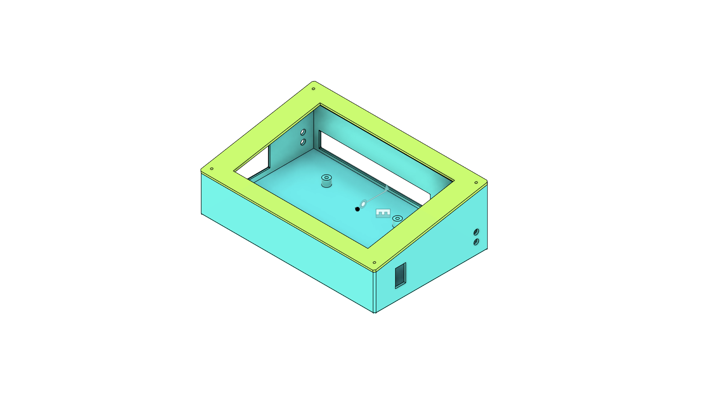
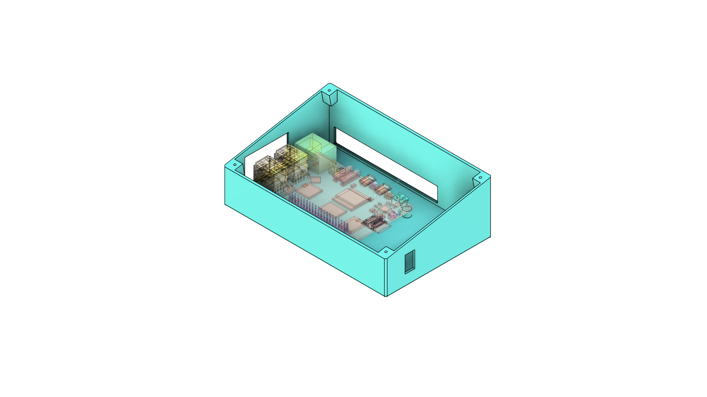
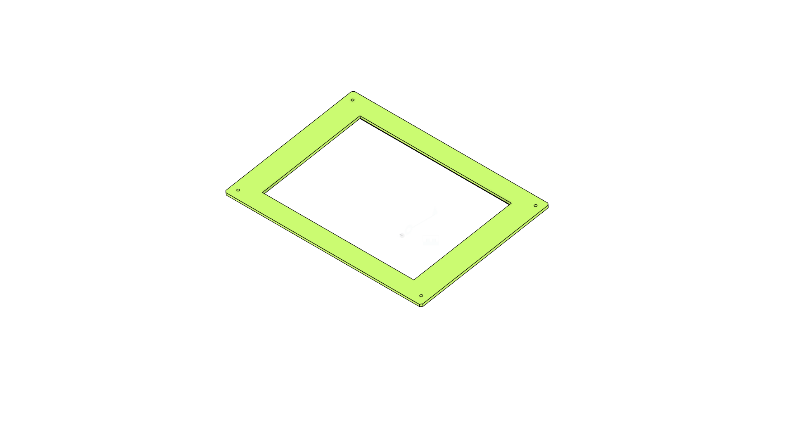

# CNC Jog Trainer

A comprehensive CNC machine training and control system featuring Arduino-based hardware control and Raspberry Pi GUI interface. This project combines robust stepper motor control, limit switch monitoring, and a modern touchscreen-optimized graphical interface for educational and practical CNC operations.

## Table of Contents

- [Overview](#overview)
- [Architecture](#architecture)
- [Features](#features)
- [Hardware Requirements](#hardware-requirements)
- [Software Components](#software-components)
- [Installation](#installation)
- [Usage](#usage)
- [Hardware Models](#hardware-models)
- [Project Structure](#project-structure)
- [Configuration](#configuration)
- [Development](#development)
- [Contributing](#contributing)
- [License](#license)

## Overview

CNC Jog Trainer is designed as an educational and practical CNC control system that bridges the gap between hardware control and user interface. The system consists of two main components:

1. **Arduino Hardware Controller** - Manages stepper motors, limit switches, piezo buzzer, and RTC clock with G-code interpretation capabilities
2. **Raspberry Pi GUI Interface** - Provides a touchscreen-optimized interface for manual jogging, G-code file management, and real-time machine monitoring

The system is specifically designed for training environments where users need to learn CNC operation principles while having access to a robust, educational platform.

## Architecture

The CNC Jog Trainer follows a modular architecture with clear separation between hardware control and user interface:

```
┌─────────────────────┐    Serial/USB    ┌──────────────────────┐
│   Raspberry Pi      │◄────────────────►│   Arduino Uno/Nano   │
│   - Python GUI      │                  │   - Stepper Control  │
│   - G-code Sender   │                  │   - Limit Switches   │
│   - Serial Comm     │                  │   - G-code Parser    │
│   - Touch Interface │                  │   - Safety Systems   │
└─────────────────────┘                  └──────────────────────┘
```

## Features

### Arduino Hardware Controller

- **Dual-Axis Stepper Control**: Precise control of X and Y axis NEMA 17 stepper motors via TB6600 drivers
- **Safety Systems**: Limit switch monitoring with automatic motion stopping
- **Audio Feedback**: Piezo buzzer for operation alerts and status notifications  
- **Real-Time Clock**: DS3231 RTC integration for timestamped operations
- **G-code Interpretation**: Support for G0/G1 movement commands with feed rate control
- **Serial Communication**: Robust command interface for external control systems
- **Modular Design**: Object-oriented C++ architecture with dedicated classes for each subsystem
- **Feed Hold Support**: Emergency stop and pause functionality

### Raspberry Pi GUI Interface

- **Touchscreen Optimization**: Large buttons and intuitive layout designed for 7-inch touchscreens
- **Manual Jog Controls**: Direct X/Y axis movement with customizable step sizes
- **G-code File Management**: Upload, validate, and send G-code files with progress tracking
- **Real-time Status Display**: Live machine coordinates, connection status, and operation feedback
- **Serial Port Management**: Automatic detection and connection to Arduino controllers
- **Homing Operations**: Automated machine homing with $H command support
- **Emergency Controls**: Pause, resume, and emergency stop functionality
- **Cross-Platform**: Compatible with Raspberry Pi and Windows environments

## Hardware Requirements

### Arduino Controller
- Arduino Uno, Nano, or compatible microcontroller
- 2x NEMA 17 stepper motors
- 2x TB6600 stepper motor drivers
- 2x Limit switches (normally open)
- Piezo buzzer
- DS3231 Real-Time Clock module
- Power supply (24V recommended for stepper drivers)
- Connecting wires and breadboard/PCB

### Raspberry Pi Interface
- Raspberry Pi 3B+ or newer
- 7-inch touchscreen display (800x480 resolution)
- MicroSD card (16GB minimum)
- USB cable for Arduino communication
- Optional: External keyboard/mouse for setup

## Software Components

### Arduino Dependencies
- Arduino IDE 1.8.19 or newer
- Wire library (included with Arduino IDE)
- RTClib library for DS3231 integration

### Raspberry Pi Dependencies
- Python 3.8 or newer
- tkinter (GUI framework)
- customtkinter (modern UI components)
- pyserial (serial communication)
- threading support

## Installation

### Arduino Setup

1. Clone the repository and navigate to Arduino source:
```bash
git clone https://github.com/qppd/CNC-Jog-Trainer.git
cd CNC-Jog-Trainer/source/arduino/JogTrainer
```

2. Install required libraries in Arduino IDE:
   - Open Arduino IDE
   - Go to Tools → Manage Libraries
   - Install "RTClib" by Adafruit

3. Configure pin assignments in `Pins.h` if needed

4. Upload `JogTrainer.ino` to your Arduino

### Raspberry Pi Setup

1. Navigate to Raspberry Pi source directory:
```bash
cd ../raspberry/JogTrainer
```

2. Install Python dependencies:
```bash
pip install -r requirements.txt
```

3. For Raspberry Pi with touchscreen, configure display settings:
```bash
# Add to /boot/config.txt
hdmi_group=2
hdmi_mode=87
hdmi_cvt 800 480 60 6 0 0 0
```

4. Run the application:
```bash
python main.py
```

## Usage

### Arduino Serial Commands

Connect to Arduino via serial monitor (115200 baud) and use these commands:

| Command | Description |
|---------|-------------|
| `X+` | Jog X axis forward |
| `X-` | Jog X axis backward |
| `Y+` | Jog Y axis forward |
| `Y-` | Jog Y axis backward |
| `LIM?` | Query limit switch status |
| `BUZ` | Test buzzer |
| `CLOCK` | Display current RTC time |
| `FEEDHOLD` | Emergency pause all motion |
| `G0 X10 Y20` | Move to coordinates (rapid) |
| `G1 X15 Y25 F100` | Move to coordinates (controlled feed) |

### GUI Interface

1. **Connection**: Select Arduino port from dropdown and click "Connect"
2. **Manual Jogging**: Use directional buttons to move axes
3. **G-code Operations**: 
   - Upload files using "Browse" button
   - Send files with "Send G-code" button
   - Monitor progress in real-time
4. **Homing**: Click "Home" button to execute $H command
5. **Emergency Stop**: Use "Feed Hold" for immediate motion pause

## Hardware Models

The project includes 3D printable enclosure models for the complete system:

### Complete Assembly



Complete system view showing the Raspberry Pi enclosure with integrated LCD mount and protective cover.

### Jog Trainer Board Case



The main controller enclosure provides:
- Secure mounting for Arduino and stepper drivers
- Ventilation for heat dissipation
- Cable management and strain relief
- Mounting points for external connections
- Professional appearance for educational environments

**Model Files:**
- `model/Jog_Trainer_Rpi_Board_Case.stl` - 3D printable STL file for main board enclosure
- `model/Jog_Trainer_Board_Case.png` - Reference image

### LCD Mount Assembly



The LCD mount assembly includes:
- Precision mounting for 7-inch touchscreen displays
- Secure attachment to Raspberry Pi enclosure
- Cable routing channels
- Adjustable viewing angles
- Protection for display connections

**Model Files:**
- `model/Jog_trainer_LCD_Mount.stl` - 3D printable STL file for LCD mount
- `model/Jog_trainer_LCD_Mount.png` - Reference image
- `model/CE3V3SE_Jog_trainer_LCD_Mount.gcode` - Pre-sliced G-code for Creality Ender 3 V3 SE

**Print Settings:**
- Layer Height: 0.2mm
- Infill: 20%
- Supports: Yes (for overhangs)
- Print Speed: 50mm/s
- Material: PLA or PETG recommended

## Project Structure

```
CNC_JOG_TRAINER/
├── README.md                                    # This file
├── diagram/                                     # System diagrams and documentation
├── model/                                       # 3D models and enclosure designs
│   ├── Jog_Trainer_Board_Case.png              # Main board enclosure reference
│   ├── Jog_Trainer_Rpi_Board_Case.stl          # 3D printable board enclosure
│   ├── Jog_trainer_LCD_Mount.png               # LCD mount reference image
│   ├── Jog_trainer_LCD_Mount.stl               # 3D printable LCD mount
│   ├── Jog_trainer_Rpi_Lcd_Case_And_Cover.png  # Complete assembly view
│   └── CE3V3SE_Jog_trainer_LCD_Mount.gcode     # Pre-sliced G-code for Ender 3 V3 SE
└── source/
    ├── arduino/
    │   └── JogTrainer/
    │       ├── JogTrainer.ino         # Main Arduino sketch
    │       ├── ClockModule.cpp/.h     # RTC functionality
    │       ├── GCodeHandler.cpp/.h    # G-code parsing and execution
    │       ├── LimitSwitch.cpp/.h     # Limit switch monitoring
    │       ├── PiezoBuzzer.cpp/.h     # Audio feedback system
    │       ├── StepperModule.cpp/.h   # Stepper motor control
    │       ├── Pins.h                 # Hardware pin definitions
    │       └── README.md              # Arduino-specific documentation
    └── raspberry/
        └── JogTrainer/
            ├── main.py                # Main GUI application
            ├── requirements.txt       # Python dependencies
            ├── ui_ux_design.md       # UI/UX design documentation
            ├── assets/               # GUI assets and resources
            ├── controller/           # Serial communication modules
            │   ├── gcode_sender.py   # G-code transmission logic
            │   └── grbl_serial.py    # GRBL communication protocol
            ├── ui_components/        # GUI component modules
            │   ├── connection_panel.py # Serial connection interface
            │   ├── file_upload.py     # G-code file management
            │   ├── jog_panel.py       # Manual control interface
            │   └── status_bar.py      # Status display component
            └── README.md             # Raspberry Pi specific documentation
```

## Configuration

### Arduino Pin Configuration

Default pin assignments in `Pins.h`:

```cpp
// Stepper Motor Pins
#define X_STEP_PIN 2
#define X_DIR_PIN 3
#define Y_STEP_PIN 4
#define Y_DIR_PIN 5

// Limit Switch Pins
#define X_LIMIT_PIN 6
#define Y_LIMIT_PIN 7

// Buzzer Pin
#define BUZZER_PIN 8

// I2C Pins for RTC (A4=SDA, A5=SCL)
```

### GUI Configuration

Modify settings in `main.py`:

```python
# Window Configuration
WINDOW_WIDTH = 800
WINDOW_HEIGHT = 480

# Serial Configuration
DEFAULT_BAUD_RATE = 115200
CONNECTION_TIMEOUT = 5.0

# Jog Step Sizes
JOG_STEPS = [0.1, 1.0, 10.0, 100.0]
```

## Development

### Building from Source

1. **Arduino Development**:
   - Use Arduino IDE 1.8.19+
   - Enable verbose compilation for debugging
   - Use serial monitor for real-time debugging

2. **Python Development**:
   - Use virtual environment for dependencies
   - Follow PEP 8 style guidelines
   - Test on both Windows and Raspberry Pi

### Adding Features

1. **New Arduino Commands**: Add to `GCodeHandler.cpp` command parser
2. **GUI Components**: Create new modules in `ui_components/`
3. **Serial Protocols**: Extend `grbl_serial.py` for new communication patterns

### Testing

- **Hardware Testing**: Use Arduino serial monitor for command validation
- **GUI Testing**: Test touch interface on actual hardware
- **Integration Testing**: Verify serial communication between components

## Contributing

1. Fork the repository
2. Create a feature branch (`git checkout -b feature/amazing-feature`)
3. Commit your changes (`git commit -m 'Add amazing feature'`)
4. Push to the branch (`git push origin feature/amazing-feature`)
5. Open a Pull Request

### Contribution Guidelines

- Follow existing code style and documentation patterns
- Test changes on actual hardware when possible
- Update documentation for new features
- Include comments for complex logic
- Verify cross-platform compatibility

## License

This project is licensed under the MIT License. See the [LICENSE](LICENSE) file for details.

## Support and Contact

For questions, issues, or contributions:

- **Issues**: Report bugs and feature requests via GitHub Issues
- **Discussions**: Use GitHub Discussions for general questions
- **Documentation**: Refer to component-specific README files in subdirectories

---

**Author**: qppd  
**Repository**: https://github.com/qppd/CNC-Jog-Trainer  
**Version**: 1.0.0  
**Last Updated**: October 2025