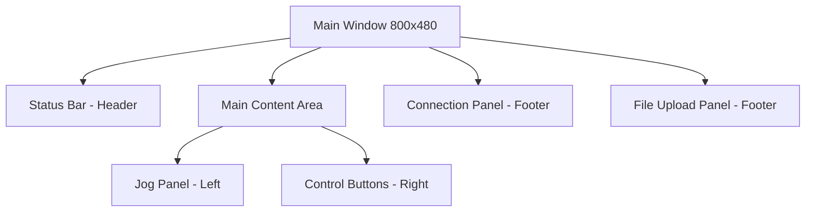

# CNC Jog Trainer - UI/UX Design Documentation

## Overview

This document provides comprehensive information about the UI/UX design of the CNC Jog Trainer application, with a focus on responsive design patterns and touchscreen optimization. The application is specifically designed for use on Raspberry Pi with a 7-inch touchscreen, but follows responsive design principles that make it adaptable to different screen sizes.

## Design Principles

### Touchscreen-First Approach
The UI is designed with touch interaction as the primary input method, following these principles:
- Large touch targets (minimum 48x48 pixels)
- Adequate spacing between interactive elements
- Visual feedback for touch interactions
- Simplified navigation and workflows

### Responsive Design Strategy
While the application uses a fixed window size of 800x480 (optimized for the target Raspberry Pi touchscreen), it implements responsive design patterns that would allow adaptation to different screen sizes:
- Grid-based layout system
- Flexible component sizing
- Relative positioning and spacing
- Adaptive component behavior

## UI Component Analysis

### Main Application Window



The main window uses a grid layout with:
- Header section (Status Bar)
- Main content area (Jog Panel + Control Buttons)
- Two footer sections (Connection Panel, File Upload Panel)

### Status Bar (Header)

**Design Features:**
- Fixed height with flexible content positioning
- Left-aligned status information
- Center-aligned application title
- Right-aligned branding/logo
- Grid column weights for responsive spacing

**Touch Optimization:**
- Large, readable text (16px bold for status, 20px bold for title)
- Clear visual separation between elements
- Adequate padding for touch-friendly spacing

### Jog Panel

**Design Features:**
- 2x3 grid layout for directional buttons
- Consistent button sizing (120x80 pixels)
- Logical arrangement matching CNC machine conventions
- Visual grouping of related controls

**Touch Optimization:**
- Large button targets suitable for precise touch input
- 5-pixel spacing between buttons to prevent accidental activation
- Bold, high-contrast text for clear button identification
- Consistent color scheme with appropriate visual feedback

**Button Layout:**
```
[X+] [Y+]
[Y-] [Z+]
[X-] [Z-]
```

### Control Buttons (Right Panel)

**Design Features:**
- Vertical arrangement of machine control functions
- Consistent button sizing (120x80 pixels)
- Color-coded buttons for different functions:
  - Green: Home (positive action)
  - Red: Reset (destructive action)
  - Gray: Neutral functions (Feed Hold, Pause, Cycle Start)

**Touch Optimization:**
- Large touch targets with clear function labels
- Visual feedback through hover color changes
- Strategic placement for easy thumb access
- Clear functional grouping

### Connection Panel (Footer)

**Design Features:**
- Horizontal layout with flexible middle section
- Dropdown menu for serial port selection
- Action buttons (Connect/Disconnect, Refresh)
- Adaptive button states based on connection status

**Touch Optimization:**
- Large dropdown menu for easy selection
- Adequate spacing between interactive elements
- Clear visual indication of connection state
- Disabled states to prevent invalid actions

### File Upload Panel (Footer)

**Design Features:**
- Flexible layout with expandable file information area
- Progress bar for visual feedback during G-code transmission
- Adaptive button states (Start/Pause/Resume)
- File name display with text truncation

**Touch Optimization:**
- Large buttons for file operations
- Progress bar with clear visual indication
- Adaptive button text to reflect current state
- Flexible label area that expands with available space

## Responsive Design Implementation

### Grid Layout System

The application uses a nested grid layout system for responsive design:

1. **Main Window Grid:**
   - Single column layout with multiple rows
   - Header (fixed) → Main Content (flexible) → Footer Sections (fixed)
   - Row weights to allocate space appropriately

2. **Main Content Grid:**
   - Four columns with equal weights
   - Three rows with equal weights
   - Jog Panel spans 2 columns and 3 rows
   - Control buttons arranged in the remaining space

### Flexible Component Sizing

Components use a combination of fixed and flexible sizing:
- Buttons: Fixed size (120x80) for consistent touch targets
- Labels: Flexible width with text wrapping
- Panels: Grid-based with weight distribution
- Spacing: Consistent padding and margins using grid options

### Adaptive Layout Patterns

The UI implements several adaptive patterns:
- **Sticky Positioning:** Components maintain their position relative to their container
- **Weight Distribution:** Available space is distributed based on component importance
- **Text Truncation:** Long text is truncated with ellipsis when space is limited
- **State-Based Layout:** Component appearance changes based on application state

## Touchscreen Optimization Features

### Touch Target Sizes

All interactive elements follow recommended touch target sizes:
- Buttons: 120x80 pixels (well above the 48x48 minimum)
- Dropdown menus: Adequate height for finger selection
- Progress bars: Sufficient height for touch interaction

### Spacing and Padding

Consistent spacing strategy:
- 5-pixel padding between buttons to prevent accidental touches
- 10-pixel padding around text elements for readability
- 10-pixel horizontal padding in the main window for edge protection
- Variable vertical padding to create visual grouping

### Visual Feedback

Touch interactions provide immediate visual feedback:
- **Hover Effects:** Color changes when buttons are touched
- **State Changes:** Button text and appearance change based on application state
- **Progress Indicators:** Visual feedback during long-running operations
- **Status Updates:** Real-time display of machine status and position

### Color and Contrast

The color scheme is optimized for touchscreen use:
- High contrast between text and background
- Color-coded buttons for quick identification
- Dark mode support for different lighting conditions
- Consistent color palette across all components

## Typography

Typography is optimized for touchscreen readability:
- Large font sizes (18px for buttons, 16px for status, 20px for titles)
- Bold weights for important information
- Clear, sans-serif fonts for maximum legibility
- Consistent text alignment and spacing

## Developer Guidelines

### Maintaining Responsive Design

When adding new components or modifying existing ones, follow these guidelines:

1. **Use Grid Layout:**
   ```python
   # Configure grid weights for flexible sizing
   self.grid_columnconfigure(0, weight=1)
   self.grid_rowconfigure(0, weight=1)
   
   # Use sticky options for proper positioning
   component.grid(row=0, column=0, sticky="nsew")
   ```

2. **Consistent Spacing:**
   - Use 5-pixel increments for padding and margins
   - Maintain consistent spacing between similar elements
   - Use padx and pady parameters in grid layouts

3. **Flexible Components:**
   - Use weight configuration for flexible resizing
   - Implement sticky positioning for adaptive layouts
   - Use anchor options for text alignment

### Touchscreen Optimization Best Practices

1. **Touch Target Sizes:**
   - Maintain minimum 48x48 pixel touch targets
   - Use larger targets (120x80) for frequently used buttons
   - Ensure adequate spacing between interactive elements

2. **Visual Feedback:**
   ```python
   # Provide hover color feedback
   button = ctk.CTkButton(
       self, 
       text="Button",
       hover_color="#D0D0D0",  # Visual feedback on touch
       command=callback
   )
   ```

3. **State Management:**
   - Update button text to reflect current state
   - Disable buttons when actions are not available
   - Provide clear visual indication of system status

### Accessibility Considerations

1. **Text Readability:**
   - Use appropriate font sizes for different elements
   - Maintain high contrast between text and background
   - Use clear, simple language for button labels

2. **Visual Hierarchy:**
   - Use size and color to indicate importance
   - Group related functions together
   - Provide clear visual separation between sections

## Future Improvements

### Responsive Enhancements
1. Implement dynamic resizing for different screen sizes
2. Add orientation change handling for landscape/portrait modes
3. Create adaptive layouts for larger displays

### Touch Interaction Improvements
1. Add gesture support for common operations
2. Implement long-press actions for additional functionality
3. Add haptic feedback for important interactions

### Visual Design Enhancements
1. Create custom icons for better visual communication
2. Implement animations for state transitions
3. Add theme customization options

## Component Roles and Responsibilities

### Main Application (main.py)
- **Role:** Central coordinator for all UI components
- **Responsibilities:**
  - Initialize and position all UI components
  - Handle application-level events and state management
  - Coordinate communication between UI and controller modules
  - Manage application lifecycle

### Jog Panel (jog_panel.py)
- **Role:** Provide manual control interface for machine movement
- **Responsibilities:**
  - Display directional control buttons (X+, X-, Y+, Y-, Z+, Z-)
  - Execute jog commands when buttons are pressed
  - Maintain consistent visual appearance

### File Upload Panel (file_upload.py)
- **Role:** Handle G-code file management and transmission
- **Responsibilities:**
  - Provide file selection interface
  - Display selected file information
  - Control G-code job execution (start, pause, resume)
  - Show transmission progress

### Status Bar (status_bar.py)
- **Role:** Display real-time machine status and position information
- **Responsibilities:**
  - Show connection status
  - Display machine coordinates (X, Y, Z)
  - Present application title and branding
  - Handle logo/image display with fallback text

### Connection Panel (connection_panel.py)
- **Role:** Manage serial communication with CNC controller
- **Responsibilities:**
  - Display available serial ports
  - Handle connection/disconnection actions
  - Show connection status
  - Provide port refresh functionality

## UI State Management

The UI implements several state management patterns:

1. **Connection State:**
   - Connected/Disconnected status affects button availability
   - Port selection is disabled when connected
   - Refresh button is disabled when connected

2. **Job Execution State:**
   - File upload enables/disables start button
   - Start button changes to Pause/Resume during execution
   - Upload button is disabled during job execution

3. **Progress State:**
   - Progress bar updates during G-code transmission
   - Status text updates with machine responses
   - Position display updates with real-time coordinates

## Performance Considerations

### UI Responsiveness
- Threading is used for serial communication to prevent UI blocking
- Progress updates are throttled to prevent excessive UI redraws
- Efficient grid layout minimizes rendering overhead

### Memory Management
- Components are properly destroyed when the application closes
- Image resources have fallback handling to prevent crashes
- Event handlers are properly cleaned up

This documentation provides a comprehensive overview of the UI/UX design for the CNC Jog Trainer application, focusing on responsive design patterns and touchscreen optimization. It serves as a guide for developers maintaining and extending the application's user interface.